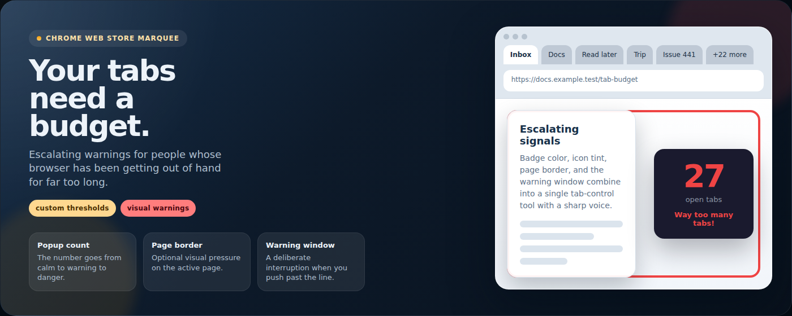

# tbr - Tab Budget Reminder

> You do not need another tab.

tbr is a Chrome extension that keeps tab overload visible with escalating warnings, a live tab count, and a dedicated warning window. It pushes back at your thresholds before the tab pile gets worse.

## 🔗 Quick Links

- 🌐 Landing page: https://cabavarga.github.io/tbr/
- 🔒 Privacy policy: https://cabavarga.github.io/tbr/privacy/
- 🛟 Support: https://github.com/CabaVarga/tbr/issues

## 👀 What It Does

- Shows your live open-tab count in the popup
- Escalates from calm to warning to danger as your tab count climbs
- Lets you choose when warning mode and danger mode should start
- Can signal overload with badge color, page border, and dynamic icon color
- Opens a dedicated warning window when you create yet another tab past the danger threshold

## 🚨 How It Pushes Back

By default, tbr warns at `10` tabs and treats `20` as danger territory. If you open a new tab while already over the danger threshold, it interrupts you with a blunt warning window and asks whether you really need it.

The goal is simple: make tab overload visible early enough that you stop pretending it is still under control.

## 🎛️ What You Can Customize

- `Warning at` threshold
- `Danger at` threshold
- Badge color warnings
- Page border warnings on the active page
- Dynamic toolbar icon color

## 🧠 Local-First By Design

tbr runs entirely in your browser. It stores your warning settings locally and does not use a backend, send tab data to a server, or sell/share your data with third parties.

It uses `tabs`, `storage`, `scripting`, and `<all_urls>` so it can count tabs, save your settings, and optionally draw the warning border on the active HTTP or HTTPS page.

## 🛠️ Tiny Dev Section

No build step.

To load it locally:

1. Open `chrome://extensions`
2. Enable Developer mode
3. Click `Load unpacked`
4. Select `src/`

That is the extension root.
